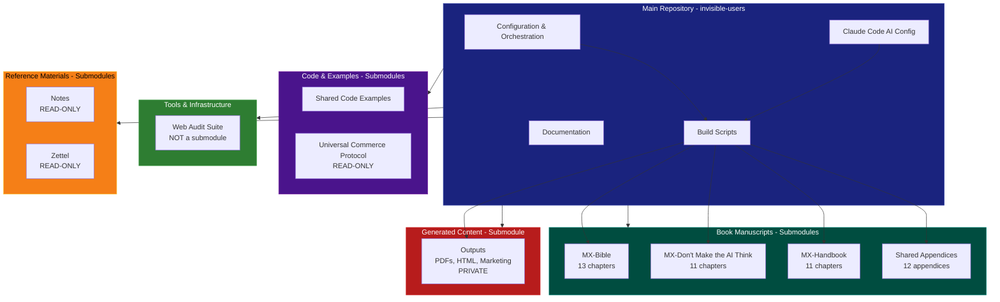
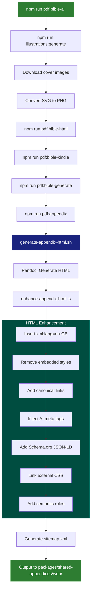
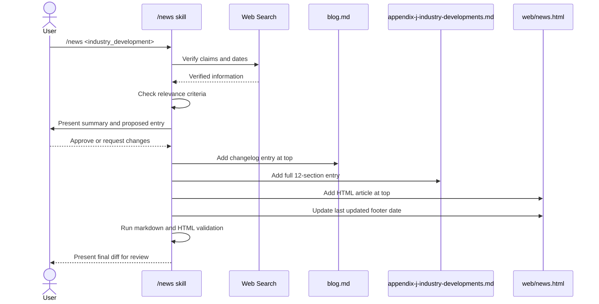
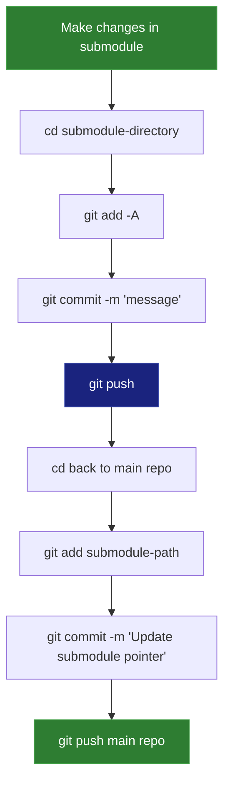

# Repository Architecture Documentation

## Overview

The `invisible-users` repository is a multi-project monorepo containing three book manuscripts (MX Series), a production-ready web analysis tool, and supporting infrastructure. The architecture uses git submodules for separation of concerns and npm workspaces for coordinated builds.

## High-Level Architecture



## Repository Structure

### Main Repository (Control Hub)

**Purpose:** Orchestration, build processes, configuration, and documentation

**Key Directories:**

- `.claude/` - Claude Code AI assistant configuration
  - `skills/` - Custom skills (/news, /review-docs, /step-commit, /md-fix, /humanizer)
  - `hooks/` - Git hooks (pre-tool-use.sh, post-tool-use.sh, pre-commit.sh, pre-push.sh)
  - `settings.local.json` - Permissions and configuration
- `config/` - Project-wide configuration
  - `.markdownlint.json` - Markdown linting rules
  - `book-svg-style.md` - SVG illustration style guide
- `scripts/` - Build and generation scripts
  - `generate-appendix-html.sh` - Appendix HTML generation
  - `enhance-appendix-html.js` - HTML post-processing
  - `download-cover-images.js` - Illustration management
- `docs/` - Documentation (main repo only)
  - `repo/` - Repository-level docs (ONBOARDING.md, GIT-README.md, LEARNINGS.md)
  - `architecture/` - Architecture documentation
  - `for-ai/` - AI assistant guidance
  - `sales-enablement/` - Business materials
  - `shared-chapters/` - Chapter 0 (shared across books)
  - `talks/` - Presentation materials
- `books/` - Convenience symlinks (tracked but directory ignored)
  - `bible -> ../packages/bible`
  - `dont-make-ai-think -> ../packages/dont-make-ai-think`
  - `mx-handbook -> ../packages/mx-handbook`
  - `appendices -> ../packages/shared-appendices`
  - `code-examples -> ../packages/shared-code-examples`
  - `outputs -> ../outputs`
- `blogs -> outputs/bible/blogs` - Symlink to outputs submodule

**Critical Files:**

- `CLAUDE.md` - Single source of truth for AI assistant configuration
- `README.md` - Main project documentation
- `package.json` - npm workspace configuration and build commands
- `LEARNINGS.md` - Battle-tested rules from mistakes
- `CHANGELOG.md` - Project change history
- `llms.txt` - AI agent discovery file

### Book Manuscripts (Content Submodules)

#### MX-Bible (packages/bible/)

**Repository:** `invisible-users-bible`
**Purpose:** Full comprehensive guide (13 chapters, ~78,000 words)
**Former Name:** "The Invisible Users"

**Structure:**

```text
packages/bible/
├── chapters/
│   ├── metadata.yaml              # PDF generation metadata
│   ├── metadata-kindle.yaml       # Kindle-specific metadata
│   ├── executive-summary.md       # Executive summary
│   ├── preface.md                 # Book preface
│   ├── chapter-01-what-you-will-learn.md
│   ├── chapter-02-the-invisible-failure.md
│   ├── chapter-03-the-architectural-conflict.md
│   ├── chapter-04-the-business-reality.md
│   ├── chapter-05-the-content-creators-dilemma.md
│   ├── chapter-06-the-security-maze.md
│   ├── chapter-07-the-legal-landscape.md
│   ├── chapter-08-the-human-cost.md
│   ├── chapter-09-the-platform-race.md
│   ├── chapter-10-generative-engine-optimization.md
│   ├── chapter-11-designing-for-both.md
│   ├── chapter-12-technical-advice.md
│   ├── chapter-13-what-agent-creators-must-build.md
│   ├── Glossary.md                # Technical glossary
│   ├── The-End.md                 # Closing material
│   ├── bible-plan.md              # Master book plan
│   ├── reading-guide.md           # Reader guidance
│   └── rear-cover.md              # Back cover copy
├── illustrations/                  # SVG and PNG images
└── README.md                       # Bible-specific documentation
```

#### MX-Don't Make the AI Think (packages/dont-make-ai-think/)

**Repository:** `invisible-users-slim`
**Purpose:** Practical quick guide (11 chapters)
**Status:** Intentionally not updated in recent rebranding (separate plan per user request)

**Structure:**

```text
packages/dont-make-ai-think/
├── chapters/
│   ├── metadata.yaml              # PDF generation metadata
│   ├── 00-cover.md                # Cover page
│   ├── preface.md                 # Book preface
│   ├── chapter-01-*.md through chapter-11-*.md
│   └── CHAPTERS-GUIDE.md          # Chapter navigation guide
└── README.md
```

#### MX-Handbook (packages/mx-handbook/)

**Repository:** `MX-The-Handbook`
**Purpose:** Implementation handbook for developers and designers (11 chapters)
**Former Name:** "MX-The Handbook"

**Structure:**

```text
packages/mx-handbook/
├── chapters/
│   ├── metadata.yaml              # PDF generation metadata
│   ├── 00-cover.md                # Cover page
│   ├── preface.md                 # Book preface
│   ├── chapter-01-*.md through chapter-11-*.md
│   └── CHAPTERS-GUIDE.md          # Chapter navigation guide
└── README.md
```

#### Shared Appendices (packages/shared-appendices/)

**Repository:** `invisible-users-appendices`
**Purpose:** Implementation guides shared across all three books (12 appendices A-L)

**Structure:**

```text
packages/shared-appendices/
├── appendix-a-glossary.md
├── appendix-b-battle-tested-lessons.md
├── appendix-c-resource-directory.md
├── appendix-d-ai-friendly-html-guide.md
├── appendix-d-ai-friendly-html-guide.txt  # Source of truth for Appendix D
├── appendix-e-schema-reference.md
├── appendix-f-implementation-roadmap.md
├── appendix-g-resource-directory.md
├── appendix-h-example-llms-txt.md
├── appendix-h-example-llms-txt.txt        # Source of truth for Appendix H
├── appendix-i-common-pitfalls.md
├── appendix-j-industry-developments.md
├── appendix-k-common-page-patterns.md
├── appendix-l-proposed-ai-metadata-patterns.md
├── appendix-m-index-of-metadata.md
├── web/                            # Generated HTML appendices
│   ├── appendix-a.html through appendix-l.html
│   ├── appendix-index.html        # Appendix navigation
│   ├── book.html                  # Book overview
│   ├── book-product-page.html     # Product page example
│   ├── back-cover.html            # Back cover
│   ├── for-reviewers.html         # Reviewer guide
│   ├── faq.html                   # FAQ
│   ├── news.html                  # Industry news
│   ├── llms.txt                   # AI agent discovery
│   ├── sitemap.xml                # Sitemap
│   ├── site/                      # Example site templates
│   │   ├── index.html, about.html, blog-post.html, etc.
│   │   └── llms.txt
│   └── [50+ HTML files total]
└── README.md
```

**Dual-File Pattern:**

- **Appendix D:** `.txt` file is source of truth (~3,000 lines), `.md` file is wrapper with TOC
- **Appendix H:** `.txt` file is source of truth (20 curated links), `.md` file is wrapper with introduction

**Critical:** Update BOTH files when making content changes.

### Code & Examples (Content Submodules)

#### Shared Code Examples (packages/shared-code-examples/)

**Repository:** `invisible-users-code-examples`
**Purpose:** Production-ready code examples demonstrating patterns from the books

**Structure:**

```text
packages/shared-code-examples/
├── agent-friendly-starter-kit/
│   ├── good/                      # Best practice examples
│   │   └── index.html
│   └── bad/                       # Anti-pattern examples
│       └── index.html
├── examples/
│   ├── html-examples/
│   │   └── structured-data/
│   │       └── book-schema.json
│   ├── identity-delegation-README.md
│   ├── identity-delegation-worker.js
│   └── site-files/
│       └── README.md
└── README.md
```

#### Universal Commerce Protocol (packages/ucp/)

**Repository:** `Universal-Commerce-Protocol/ucp`
**Purpose:** Reference implementation of ecommerce standard for AI agents
**Status:** READ-ONLY (external project maintained separately)

**Structure:**

```text
packages/ucp/
├── docs/                          # UCP documentation
├── generated/                     # Generated schemas and types
├── main.py                        # Schema generator
└── README.md
```

### Tools & Infrastructure

#### Web Audit Suite (packages/web-audit-suite/)

**Status:** NOT a submodule (regular directory)
**Purpose:** Production-ready Node.js website analysis tool implementing book patterns

**Structure:**

```text
packages/web-audit-suite/
├── src/
│   ├── cli.js                     # Command-line interface
│   ├── config/                    # Configuration
│   ├── core/                      # Core audit logic
│   ├── phases/                    # Four-phase pipeline
│   │   ├── 0-robots-compliance/
│   │   ├── 1-url-collection/
│   │   ├── 2-data-collection/
│   │   └── 3-report-generation/
│   ├── utils/                     # Shared utilities
│   └── index.js
├── test/                          # Test files
├── .cache/                        # Cache directory
├── results/                       # Output directory
│   └── results.json               # Single source of truth
└── README.md
```

**Architecture:** Four-phase pipeline

0. **robots.txt Compliance** - Fetch, parse, validate (100-point quality score)
1. **URL Collection** - Sitemap processing with robots.txt validation
2. **Data Collection** - Concurrent URL processing, browser pooling, Pa11y, LLM metrics
3. **Report Generation** - CSV/markdown reports, pattern extraction, regression detection

**Critical:** `results/results.json` is single source of truth. Report generation NEVER fetches new data.

### Generated Content (Private Submodule)

#### Outputs (outputs/)

**Repository:** `invisible-users-outputs` (PRIVATE)
**Purpose:** Storage for all generated materials, kept separate from source content

**Structure:**

```text
outputs/
├── bible/                         # MX-Bible outputs
│   ├── blogs/                     # Blog posts
│   │   ├── agent-ecosystem-acceleration.md
│   │   ├── blog.md
│   │   ├── boye-co-member-call-review.md
│   │   └── chapter-0-blog.md
│   ├── presentations/             # Slide decks
│   └── marketing/                 # Marketing materials
├── dont-make-ai-think/            # MX-Don't Make the AI Think outputs
├── mx/                            # MX-Handbook outputs
├── the-bible/                     # Legacy directory name
│   ├── mx-bible.html              # HTML output
│   ├── mx-bible.pdf               # A4 PDF
│   ├── mx-bible-kindle.pdf        # 6"×9" Kindle PDF
│   └── mx-bible-simple.pdf        # Simple PDF
└── README.md
```

### Reference Materials (Read-Only Submodules)

#### Notes (packages/notes/)

**Repository:** `Notes`
**Purpose:** Development notes, coding standards, and architectural guidelines
**Status:** READ-ONLY for AI assistants unless explicitly authorized

**Contains:** Coding standards, project setup guidelines, backend architecture patterns, UI/UX anti-patterns

#### Zettel (packages/zettel/)

**Repository:** `Zettel`
**Purpose:** Personal Zettelkasten note-taking repository
**Status:** READ-ONLY for AI assistants unless explicitly authorized

## Build System Architecture

### PDF Generation Pipeline



### Appendix HTML Enhancement Process

**Script:** `scripts/enhance-appendix-html.js`

**Purpose:** Post-process Pandoc-generated HTML to add AI-friendly patterns, semantic structure, and Schema.org metadata

**Enhancements Applied:**

1. **Language Declaration:** `xml:lang="en-GB"`
2. **Style Removal:** Remove embedded Pandoc styles
3. **Canonical Links:** `<link rel="canonical">`
4. **AI Meta Tags:**
   - `<meta name="llms-txt" content="/llms.txt">`
   - Other AI-specific metadata
5. **Schema.org JSON-LD:** Structured data for search engines and AI agents
6. **External CSS:** Link to `appendix.css`
7. **Semantic Roles:** ARIA roles and data attributes for accessibility
8. **Validation:** HTML validation and link checking

**Input:** Raw HTML from Pandoc
**Output:** Enhanced HTML in `packages/shared-appendices/web/`

### News Update Workflow



## Git Workflow Architecture

### Submodule-First Workflow

**Critical Principle:** Always commit and push submodules BEFORE updating pointers in main repository.



### Multi-Repository Structure

**10 git repositories total:**

1. **Main repo:** `invisible-users` (control hub)
2. **MX-Bible:** `invisible-users-bible`
3. **MX-Don't Make the AI Think:** `invisible-users-slim`
4. **MX-Handbook:** `MX-The-Handbook`
5. **Appendices:** `invisible-users-appendices`
6. **Code Examples:** `invisible-users-code-examples`
7. **UCP:** `Universal-Commerce-Protocol/ucp` (READ-ONLY)
8. **Outputs:** `invisible-users-outputs` (PRIVATE)
9. **Notes:** `Notes` (READ-ONLY)
10. **Zettel:** `Zettel` (READ-ONLY)

**Navigation Safety:**

- Always run `pwd` before file operations or git commands
- Use `git -C <submodule-path>` to avoid navigation errors
- Never assume current location in multi-repository workspace
- Use `git mv` for renaming tracked files (preserves history)

## Claude Code AI Integration

### Skill Architecture

**Location:** `.claude/skills/`

**Five Custom Skills:**

1. **`/step-commit`** - Systematic commit workflow for multi-repository structure
2. **`/md-fix`** - Markdown linting and auto-fix
3. **`/news`** - Add verified industry news with strict relevance criteria
4. **`/review-docs`** - Review documents against complete writing style guide
5. **`/humanizer`** - Remove AI-generated writing patterns

### Hook System

**Location:** `.claude/hooks/`

**Four Git Hooks:**

1. **`pre-tool-use.sh`** - Manuscript style reminders, directory navigation safety, pwd reminders
2. **`pre-commit.sh`** - Markdown linting checks
3. **`pre-push.sh`** - Documentation outdated warnings
4. **`post-tool-use.sh`** - `/step-commit` workflow reminders

### Configuration

**Location:** `.claude/settings.local.json`

**Contains:**

- Permissions for Bash commands
- Tool access configuration
- Session-scoped settings

## Book Naming Architecture

### Public Names (Official Titles)

- **"MX-Bible"** - Full comprehensive guide (formerly "The Invisible Users")
- **"MX-Don't Make the AI Think"** - Practical quick guide
- **"MX-Handbook"** - Implementation handbook

### Shorthand Reference System

**For use in AI assistant prompts:**

| Shorthand      | Refers to                                                   |
| -------------- | ----------------------------------------------------------- |
| **bible**      | MX-Bible (full comprehensive guide)                         |
| **dont**       | MX-Don't Make the AI Think (practical quick guide)          |
| **handbook**   | MX-Handbook (implementation handbook)                       |
| **slim**       | MX-Handbook (synonym for handbook)                          |
| **books**      | All three books                                             |
| **manuscript** | All three books                                             |
| **project**    | Everything in workspace EXCEPT read-only repos              |
| **workspace**  | Everything in workspace EXCEPT read-only repos              |

**Note:** Directory names and repository names remain unchanged. This mapping only affects how books are referenced in documentation and prompts.

## Separation of Concerns

### Principle

**Clean separation between content and orchestration:**

- **Main repository:** Control hub (build scripts, npm packages, configuration)
- **Content submodules:** Pure content (markdown, code examples, no dependencies)
- **Outputs submodule:** Generated materials (private, separate from source)

### Benefits

1. **Independent version control** - Content changes don't pollute main repository history
2. **No dependency sprawl** - Content repositories have no package.json, no npm install
3. **Clean collaboration** - Writers work in content repos, developers in main repo
4. **Reusability** - Content can be referenced by other projects without tooling
5. **Access control** - Private outputs repository separate from public content
6. **Build isolation** - All build processes controlled from single location

### Build Commands Location

**Critical:** Submodules cannot be built independently. All build commands run from parent `invisible-users` repository:

```bash
# ✅ CORRECT: Run from main repo
cd invisible-users
npm run pdf:bible-all

# ❌ WRONG: Cannot run from submodule
cd invisible-users/packages/bible
npm run pdf:generate  # No package.json in submodule
```

## Documentation Architecture

### Levels of Documentation

1. **Repository-level** (main repo `docs/repo/`)
   - ONBOARDING.md - Developer onboarding
   - GIT-README.md - Git workflow guide
   - LEARNINGS.md - Battle-tested rules
   - PROJECTSTATE.md - Current status
   - TIMELESS-MANUSCRIPT-RULE.md - Writing guidelines

2. **Package-level** (each submodule `README.md`)
   - Package-specific contents
   - Build instructions
   - Chapter lists
   - Word counts

3. **Architecture** (`docs/architecture/`)
   - doc-architecture.md - This file
   - web-audit-architecture.md - Tool architecture

4. **AI Assistant Guidance** (`docs/for-ai/`)
   - writing-style.md - Complete style guide
   - yaml-frontmatter-template.md - Metadata template
   - architecting-multi-repo-codebases.md - Multi-repo patterns

5. **Business Materials** (`docs/sales-enablement/`)
   - Business plans
   - Partner kits
   - Publisher proposals
   - Pricing strategies

### Documentation Flow

**Changes must flow:** book → tool → documentation

1. Update book manuscript first
2. Update Web Audit Suite implementation
3. Update all documentation

**Consistency Mandate:** Same terms mean the same thing everywhere.

## Key Organizational Principles

### The Book is Authoritative

Book manuscripts are the authoritative source for all terminology, patterns, and concepts. If conflict exists, implementation must be updated to match the book.

### The Tool Implements the Book

Web Audit Suite implements patterns from the book:

- Detects patterns described in the book
- Uses terminology from the book
- Provides recommendations based on book guidance

### All Documentation Must Align

Consistency is mandatory across all projects:

- Same terms mean the same thing everywhere
- Examples are consistent
- Cross-references are accurate

## Symlink Architecture

### Purpose

Reduce cognitive load when navigating the repository by providing shorter paths.

### Symlinks (tracked but directory ignored)

Located in `books/` directory:

```text
books/bible -> ../packages/bible
books/dont-make-ai-think -> ../packages/dont-make-ai-think
books/mx-handbook -> ../packages/mx-handbook
books/appendices -> ../packages/shared-appendices
books/code-examples -> ../packages/shared-code-examples
books/outputs -> ../outputs
```

Located at root:

```text
blogs -> outputs/bible/blogs
```

### Usage Pattern

```bash
# ✅ SHORTER: Use symlink
cat books/bible/README.md

# ❌ LONGER: Use full path
cat packages/bible/README.md

# Both work, symlink is preferred for reduced cognitive overhead
```

### Git Behavior

- Symlinks are tracked in git (committed before ignore pattern was added)
- `books/` directory is in `.gitignore` to prevent accidental additions
- Git only ignores untracked files; already-tracked symlinks remain tracked

## Technology Stack

### Document Generation

- **Pandoc** - Markdown to HTML/PDF conversion
- **XeLaTeX** - PDF typesetting engine
- **ImageMagick** - SVG to PNG conversion

### Build System

- **npm** - Package management and script orchestration
- **npm workspaces** - Monorepo coordination
- **Bash scripts** - Build automation

### Web Analysis

- **Node.js** - Runtime environment
- **Pa11y** - Accessibility testing
- **Puppeteer** - Browser automation
- **Playwright** - Alternative browser automation

### Documentation

- **Markdown** - Content format
- **Mermaid** - Diagrams and flowcharts
- **YAML** - Frontmatter metadata

### Linting & Validation

- **markdownlint** - Markdown style checking
- **html-validate** - HTML validation
- **ESLint** - JavaScript linting

## Version Control Strategy

### Main Repository

- Branch: `main`
- Remote: `https://github.com/ddttom/invisible-users`
- Push after all submodules are pushed

### Submodules

- Branch: `main` (each has independent main branch)
- Push before updating main repository pointers
- Each submodule is an independent git repository

### Commit Guidelines

- Clear subject line (50 characters max recommended)
- Optional body for detailed explanation
- No co-author attribution or "Generated with Claude Code" messages
- Focus on changes, not tools used

## AI Agent Compatibility

### Discovery File

**Location:** `llms.txt` (root and in `packages/shared-appendices/web/`)

**Purpose:** Help AI agents discover and understand the project structure

**Format:** Markdown table with metadata and links

### Metadata Patterns

**YAML Frontmatter:** Used in all book manuscript files

**Required Fields:**

- `title` - Chapter/document title
- `author` - Always "Tom Cranstoun"
- `date` - Last modification date (YYYY-MM-DD)
- `description` - Brief summary
- `keywords` - Array of topics
- `book` - Which book (MX-Bible, MX-Don't Make the AI Think, MX-Handbook)
- `chapter` - Chapter number
- `wordcount` - Approximate word count
- `ai-instruction` - Instructions for AI agents parsing the document

### Timeless Manuscript Rule

**Critical Writing Requirement:** Book manuscripts must be written as if they've always existed.

**Never Include:**

- Publication dates or launch dates about the book itself
- "This update includes..." or "We have added..."
- "New in this version..." or "Recently launched..."
- Future-tense statements about the book
- Meta-commentary about the writing/editing process

**Always Write:**

- Definitive present tense: "The analysis provides..."
- Timeless descriptions: "This book is part of a three-book series:"
- Established fact tone: Features described as if they've always existed

**Exception:** Historical context about subject matter is allowed (e.g., "Google launched UCP in January 2026").

## Future Architecture Considerations

### Potential Enhancements

1. **Automated Testing** - Add test suite for build scripts
2. **CI/CD Pipeline** - GitHub Actions for automated builds
3. **Docker Support** - Containerized build environment
4. **API Documentation** - OpenAPI spec for Web Audit Suite
5. **Performance Monitoring** - Track build times and optimization

### Scalability Concerns

- Monorepo size growth as content increases
- Build time optimization for large PDF generation
- Submodule management complexity with more repositories
- Output storage in private submodule (may need CDN)

## Contact and Resources

- **Email:** <tom.cranstoun@gmail.com>
- **Website:** <https://allabout.network>
- **LinkedIn:** <https://www.linkedin.com/in/tom-cranstoun/>
- **Repository:** <https://github.com/ddttom/invisible-users>

## Related Documentation

- [README.md](../../README.md) - Main project documentation
- [CLAUDE.md](../../CLAUDE.md) - AI agent instructions
- [LEARNINGS.md](../../LEARNINGS.md) - Battle-tested rules
- [GIT-README.md](../repo/GIT-README.md) - Git workflow guide
- [ONBOARDING.md](../repo/ONBOARDING.md) - Developer onboarding
- [web-audit-architecture.md](web-audit-architecture.md) - Web Audit Suite architecture
