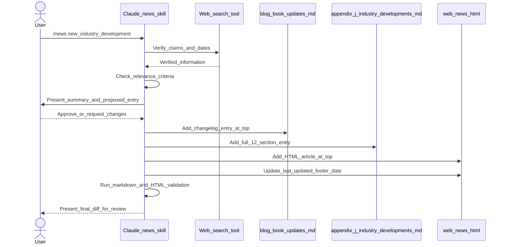

Reviewer's Guide
Restructures the repo into an npm workspaces monorepo, updates all paths and tooling to match, and evolves the book/web stack with new HTML tooling, Docker support, AI/SEO patterns, and removal of the deprecated Identity Delegation project while keeping appendices and Web Audit Suite in sync.

## Sequence Diagram: /news Skill Post-Publication Update Across Three Files

## Flow Diagram: Appendix HTML Generation and Enhancement

```mermaid
flowchart TB
    A[Developer runs npm run pdf:appendix] --> B[generate-appendix-html.sh]

    B --> C[Set MANUSCRIPT_DIR packages/manuscript/the-bible-of-mx]
    C --> D[Set OUTPUT_DIR packages/manuscript/the-bible-of-mx/web]

    D --> E[Create appendix nav header footer fragments]
    E --> F[Run Pandoc to generate appendix HTML]

    F --> G[Generate llms.txt in OUTPUT_DIR]

    G --> H[Validate news.html exists in OUTPUT_DIR]
    H --> I[Validate faq.html exists in OUTPUT_DIR]

    I --> J[Call generate-sitemap.js]

    J --> K[enhance-appendix-html.js for each appendix]

    subgraph enhance[enhance-appendix-html.js]
        K1[Read raw appendix HTML]
        K2[Insert xml:lang=en-GB]
        K3[Remove embedded style block]
        K4[Add link rel=canonical]
        K5[Inject AI meta tags including llms-txt]
        K6[Inject Schema.org JSON-LD]
        K7[Link external appendix.css]
        K8[Add semantic roles and data attributes]
        K9[Write enhanced HTML back to OUTPUT_DIR]
    end

    K --> K1 --> K2 --> K3 --> K4 --> K5 --> K6 --> K7 --> K8 --> K9

    K9 --> L[Appendix index.html updated with appendix L links]
    L --> M[Final output: 18 files in web directory]

    style B fill:#1a237e,stroke:#3949ab,color:#fff
    style enhance fill:#004d40,stroke:#00897b,color:#fff
    style J fill:#4a148c,stroke:#7b1fa2,color:#fff
    style A fill:#2e7d32,stroke:#43a047,color:#fff
    style M fill:#2e7d32,stroke:#43a047,color:#fff
```

