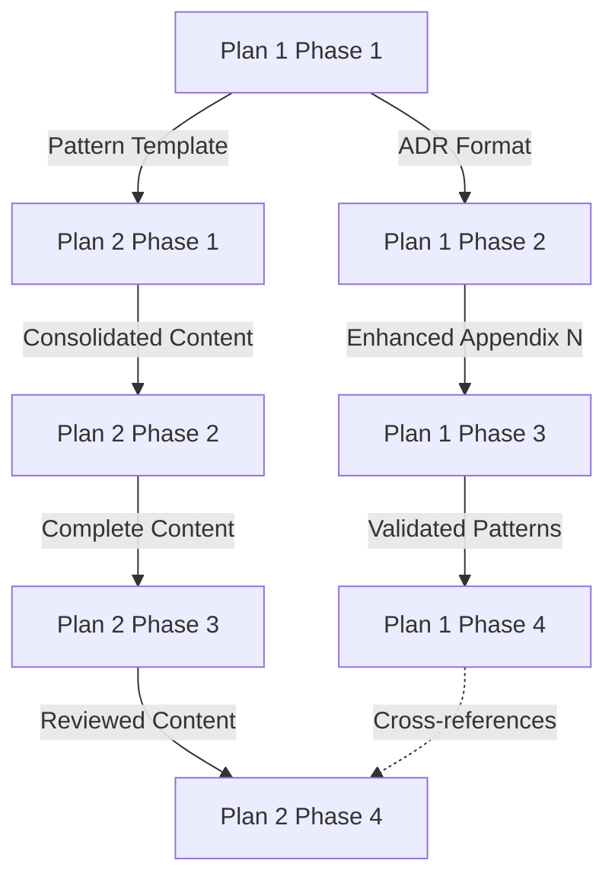

# MX Patterns Project Roadmap

## Executive Summary

This roadmap coordinates two parallel initiatives for MX pattern documentation:

- **Plan 1:** Extract pattern content (Cards, ADR records) into existing MX-Bible chapters
- **Plan 2:** Structure and create new book "MX: The Patterns of Machine Experience"

The roadmap manages dependencies between plans, establishes milestones, and provides integrated timeline tracking. Both plans can proceed in parallel with coordination points to ensure consistency.

## Project Vision

Create comprehensive pattern documentation that serves two distinct purposes:

1. **MX-Bible Enhancement:** Integrate practical pattern documentation into existing comprehensive guide
2. **MX Patterns Book:** Create dedicated pattern language reference for advanced practitioners

Both outputs reinforce each other: MX-Bible provides context and motivation, MX Patterns provides detailed implementation patterns.

## Strategic Objectives

### Objective 1: Enhance MX-Bible with Actionable Patterns

**Metrics:**
- 13 anti-patterns converted to full ADR format
- 5-7 pattern cards added to Chapter 12
- 1 new appendix (Appendix O) created
- Pattern philosophy integrated into Chapter 11
- Zero voice inconsistencies

**Timeline:** 8 weeks

### Objective 2: Launch MX Patterns Book

**Metrics:**
- 12 chapters completed (73,000-105,000 words)
- 5 appendices completed
- 100% cross-references resolve
- PDF and HTML formats generated
- Community preview launched

**Timeline:** 16 weeks

### Objective 3: Establish Pattern-Based Documentation Standards

**Metrics:**
- Pattern template standardised
- ADR format adopted across both books
- Validation checklist published
- Community contribution guidelines established

**Timeline:** Ongoing throughout both plans

## Integrated Timeline Overview

### Timeline Visualisation

```
Week  1  2  3  4  5  6  7  8  9 10 11 12 13 14 15 16
Plan 1: [============================================]
        Phase 1  Phase 2     Phase 3           Phase 4
Plan 2:    [================================================]
           Phase 1         Phase 2              Phase 3  P4

Legend:
[====] Active work
   ☐   Coordination point
   ✓   Milestone
```

### Coordination Points

| Week | Coordination Activity | Purpose |
|------|----------------------|---------|
| 2 | Pattern template alignment | Ensure both plans use same format |
| 4 | Cross-reference strategy | Plan linking between books |
| 6 | Voice consistency review | Check editorial alignment |
| 8 | Plan 1 completion / Plan 2 midpoint | Knowledge transfer |
| 12 | Cross-book reference audit | Verify all links work |
| 16 | Final review and launch | Coordinate releases |

## Plan 1 Detailed Schedule

### Phase 1: Content Mapping (Week 1)

**Objectives:**
- Identify all integration points in MX-Bible
- Create content mapping documentation
- Design Appendix O structure
- Establish transformation rules

**Tasks:**
- [x] Review all Futures/*.md files
- [ ] Map content to MX-Bible chapters
- [ ] Design ADR transformation template
- [ ] Create Quick Start Card format
- [ ] Write Appendix O outline

**Deliverables:**
- [ ] Content mapping table complete
- [ ] Transformation rules documented
- [ ] Appendix O structure approved

**Dependencies:**
- Access to all source files
- MX-Bible current structure

**Milestone:** Content mapping complete ✓

### Phase 2: Appendix N Enhancement (Weeks 2-3)

**Objectives:**
- Convert all 13 anti-patterns to full ADR format
- Add architecture diagrams
- Establish cross-references

**Tasks:**
- [ ] Convert Anti-Pattern 1-4 to ADR format
- [ ] Convert Anti-Pattern 5-8 to ADR format
- [ ] Convert Anti-Pattern 9-13 to ADR format
- [ ] Generate architecture diagrams
- [ ] Add cross-references to patterns
- [ ] Editorial review

**Deliverables:**
- [ ] 13 patterns in full ADR format
- [ ] 5-7 architecture diagrams (SVG)
- [ ] Cross-reference network established

**Dependencies:**
- Appendix N current state
- ADR template from Phase 1

**Milestone:** Appendix N enhanced ✓

### Phase 3: Chapter Integration (Weeks 4-7)

**Objectives:**
- Add pattern cards to Chapter 12
- Integrate pattern philosophy into Chapter 11
- Add GEO patterns to Chapter 10
- Create Appendix O

**Tasks:**

**Week 4:**
- [ ] Create Appendix O (Pattern Templates)
- [ ] Add 2 pattern cards to Chapter 12
- [ ] Begin Chapter 11 integration

**Week 5:**
- [ ] Add 3 more pattern cards to Chapter 12
- [ ] Complete Chapter 11 integration
- [ ] Begin Chapter 10 GEO patterns

**Week 6:**
- [ ] Complete Chapter 10 integration
- [ ] Add final pattern cards to Chapter 12
- [ ] Internal review

**Week 7:**
- [ ] Address review feedback
- [ ] Verify all cross-references
- [ ] Editorial polish

**Deliverables:**
- [ ] Appendix O complete
- [ ] 5-7 pattern cards in Chapter 12
- [ ] Pattern philosophy in Chapter 11
- [ ] GEO patterns in Chapter 10

**Dependencies:**
- Appendix N completion (Phase 2)
- Pattern template from Phase 1

**Milestone:** Chapter integration complete ✓

### Phase 4: Validation (Week 8)

**Objectives:**
- Complete validation checklist
- Editorial and technical review
- Markdown linting
- PDF regeneration

**Tasks:**
- [ ] Run validation checklist
- [ ] Editorial review
- [ ] Technical review
- [ ] Fix all linting errors
- [ ] Verify cross-references
- [ ] Regenerate PDF (all formats)
- [ ] Update documentation

**Deliverables:**
- [ ] Validation checklist completed
- [ ] All reviews complete
- [ ] Zero linting errors
- [ ] Updated PDF files

**Dependencies:**
- All Phase 3 deliverables complete

**Milestone:** Plan 1 complete ✓

## Plan 2 Detailed Schedule

### Phase 1: Content Consolidation (Weeks 2-5)

**Objectives:**
- Consolidate all Futures/*.md files
- Add YAML frontmatter
- Establish repository structure
- Create cross-reference system

**Tasks:**

**Week 2:**
- [ ] Create `packages/mx-patterns/` structure
- [ ] Copy Futures/*.md to new location
- [ ] Add frontmatter to Chapters 1-3

**Week 3:**
- [ ] Add frontmatter to Chapters 4-6
- [ ] Add frontmatter to Chapters 7-9
- [ ] Design cross-reference system

**Week 4:**
- [ ] Add frontmatter to Chapters 10-12
- [ ] Format Appendices A-C
- [ ] Create chapter numbering system

**Week 5:**
- [ ] Implement cross-reference placeholders
- [ ] Initial word count assessment
- [ ] Repository structure review

**Deliverables:**
- [ ] 12 chapters with frontmatter
- [ ] Appendices A-C formatted
- [ ] Cross-reference system designed
- [ ] Word count baseline established

**Dependencies:**
- Repository permissions
- Source files accessible

**Milestone:** Content consolidation complete ✓

### Phase 2: Content Creation (Weeks 6-11)

**Objectives:**
- Write preface and executive summary
- Create Appendix D and E
- Write chapter transitions
- Establish working cross-references

**Tasks:**

**Week 6:**
- [ ] Draft preface (1st pass)
- [ ] Draft executive summary (1st pass)
- [ ] Begin glossary extraction

**Week 7:**
- [ ] Revise preface (2nd pass)
- [ ] Revise executive summary (2nd pass)
- [ ] Continue glossary (50% complete)

**Week 8:**
- [ ] Finalise preface
- [ ] Finalise executive summary
- [ ] Complete glossary extraction

**Week 9:**
- [ ] Create Appendix D (validation checklist)
- [ ] Begin Appendix E (glossary formatting)
- [ ] Write transitions (Chapters 1-4)

**Week 10:**
- [ ] Complete Appendix E
- [ ] Write transitions (Chapters 5-8)
- [ ] Implement cross-references (50%)

**Week 11:**
- [ ] Write transitions (Chapters 9-12)
- [ ] Complete cross-references (100%)
- [ ] Internal review

**Deliverables:**
- [ ] Preface complete
- [ ] Executive summary complete
- [ ] Appendix D complete
- [ ] Appendix E complete
- [ ] All chapter transitions written
- [ ] Cross-references functional

**Dependencies:**
- Phase 1 completion
- Coordination with Plan 1 (Week 8)

**Milestone:** Content creation complete ✓

### Phase 3: Editorial Review (Weeks 12-14)

**Objectives:**
- Voice consistency review
- Technical accuracy review
- Cross-reference verification
- Markdown linting

**Tasks:**

**Week 12:**
- [ ] Editorial review (Chapters 1-6)
- [ ] Technical review (Chapters 1-6)
- [ ] Cross-reference audit (full book)

**Week 13:**
- [ ] Editorial review (Chapters 7-12)
- [ ] Technical review (Chapters 7-12)
- [ ] Fix linting errors

**Week 14:**
- [ ] Review appendices
- [ ] Address all feedback
- [ ] Final editorial polish
- [ ] Verify all cross-references

**Deliverables:**
- [ ] Editorial review complete
- [ ] Technical review complete
- [ ] Zero linting errors
- [ ] All cross-references verified

**Dependencies:**
- Phase 2 completion
- Coordination with Plan 1 (Week 12)

**Milestone:** Editorial review complete ✓

### Phase 4: Production (Weeks 15-16)

**Objectives:**
- Generate bibliography
- Generate index
- Design cover
- Generate PDF formats
- Create HTML version

**Tasks:**

**Week 15:**
- [ ] Generate bibliography
- [ ] Begin index generation
- [ ] Design cover (1st draft)
- [ ] Generate PDF (A4 format)

**Week 16:**
- [ ] Complete index
- [ ] Finalise cover design
- [ ] Generate PDF (6"×9" format)
- [ ] Generate HTML version
- [ ] Community preview launch

**Deliverables:**
- [ ] Bibliography complete
- [ ] Index complete
- [ ] Cover designed
- [ ] PDF (A4, 6"×9")
- [ ] HTML version
- [ ] Community preview live

**Dependencies:**
- Phase 3 completion

**Milestone:** Plan 2 complete / Book launched ✓

## Dependency Management

### Critical Dependencies



### Dependency Table

| Dependent Task | Depends On | Type | Impact if Blocked |
|----------------|------------|------|-------------------|
| Plan 2 Phase 1 | Plan 1 Phase 1 | Pattern template | Medium - can proceed with draft |
| Plan 1 Phase 2 | Plan 1 Phase 1 | ADR format | High - cannot start |
| Plan 1 Phase 3 | Plan 1 Phase 2 | Enhanced Appendix N | High - cannot start |
| Plan 2 Phase 2 | Plan 2 Phase 1 | Consolidated content | High - cannot start |
| Plan 1 Phase 4 | Plan 1 Phase 3 | All integrations | High - cannot validate |
| Plan 2 Phase 3 | Plan 2 Phase 2 | Complete content | High - nothing to review |
| Plan 2 Phase 4 | Plan 2 Phase 3 | Reviewed content | High - cannot publish |
| Cross-book refs | Both Plan 1 Phase 4 & Plan 2 Phase 4 | Coordination | Medium - can fix post-launch |

## Resource Allocation

### Personnel Requirements

| Role | Plan 1 Hours/Week | Plan 2 Hours/Week | Peak Weeks |
|------|-------------------|-------------------|------------|
| Technical Writer | 15-20 | 20-25 | 4-7, 9-11 |
| Editor | 5-10 | 10-15 | 7-8, 12-14 |
| Technical Reviewer | 5-10 | 5-10 | 2-3, 12-13 |
| Accessibility Specialist | 2-5 | 2-5 | 8, 14 |
| Designer | 0-2 | 5-10 | 15-16 |
| Project Manager | 3-5 | 3-5 | All weeks |

### Tool Requirements

**Essential Tools:**
- Markdown editor (VS Code, Typora, or similar)
- Git for version control
- Markdown linter (`markdownlint`)
- HTML validator (`html-validate`)
- PDF generation (Pandoc)
- SVG editor (Inkscape, Figma)

**Optional Tools:**
- Project management (Notion, Jira, or similar)
- Diagram generation (Mermaid, PlantUML)
- Reference management (Zotero, BibTeX)
- Collaboration platform (GitHub, GitLab)

## Risk Register

### High Priority Risks

| Risk | Likelihood | Impact | Mitigation | Owner |
|------|-----------|--------|------------|-------|
| Voice inconsistency between books | Medium | High | Weekly editorial reviews | Editor |
| Timeline overrun | High | Medium | Buffer time in phases | PM |
| Technical inaccuracy | Low | High | Expert reviews at milestones | Tech Reviewer |
| Resource unavailability | Medium | High | Cross-training team members | PM |
| Scope creep | Medium | High | Strict adherence to plans | PM |

### Medium Priority Risks

| Risk | Likelihood | Impact | Mitigation | Owner |
|------|-----------|--------|------------|-------|
| Cross-reference errors | Medium | Medium | Automated link checker | Technical Writer |
| Markdown linting failures | High | Low | Pre-commit hooks | Technical Writer |
| Glossary incompleteness | Medium | Medium | Systematic term extraction | Technical Writer |
| Cover design delays | Medium | Low | Start design early | Designer |
| PDF generation issues | Low | Medium | Test early and often | Technical Writer |

### Risk Response Plans

**If Plan 1 falls behind schedule:**
1. Prioritise Appendix N and Chapter 12 (highest impact)
2. Defer Chapter 10 and 11 enhancements to later iteration
3. Focus on completing Appendix O as priority

**If Plan 2 falls behind schedule:**
1. Reduce executive summary scope
2. Simplify chapter transitions
3. Generate basic index (can enhance post-launch)
4. Launch with community preview status

**If technical reviewer unavailable:**
1. Activate backup reviewer
2. Extend review period
3. Split chapters across multiple reviewers
4. Use AI-assisted technical checking

## Quality Gates

### Gate 1: Content Mapping Complete (Week 1)

**Criteria:**
- [ ] All source files reviewed
- [ ] Integration points identified
- [ ] Transformation rules defined
- [ ] Stakeholder approval received

**Approval Required:** Project Manager

### Gate 2: Appendix N Enhanced (Week 3)

**Criteria:**
- [ ] All 13 patterns in ADR format
- [ ] Technical review passed
- [ ] No linting errors
- [ ] Cross-references functional

**Approval Required:** Technical Reviewer, Editor

### Gate 3: Plan 1 Complete (Week 8)

**Criteria:**
- [ ] All chapters integrated
- [ ] Appendix O complete
- [ ] Validation checklist passed
- [ ] PDF regenerated successfully

**Approval Required:** Project Manager, Editor, Technical Reviewer

### Gate 4: Content Creation Complete (Week 11)

**Criteria:**
- [ ] All front matter written
- [ ] All appendices complete
- [ ] Chapter transitions written
- [ ] Cross-references functional

**Approval Required:** Project Manager, Editor

### Gate 5: Editorial Review Complete (Week 14)

**Criteria:**
- [ ] Voice consistency verified
- [ ] Technical accuracy confirmed
- [ ] Zero linting errors
- [ ] All feedback addressed

**Approval Required:** Editor, Technical Reviewer

### Gate 6: Plan 2 Complete (Week 16)

**Criteria:**
- [ ] All formats generated
- [ ] Cover finalised
- [ ] Community preview live
- [ ] Documentation updated

**Approval Required:** Project Manager, Stakeholder

## Success Criteria

### Plan 1 Success Criteria

**Quantitative:**
- [ ] 13 anti-patterns fully converted
- [ ] 5-7 pattern cards added
- [ ] 1 new appendix created
- [ ] 100% cross-references resolve
- [ ] Zero linting errors
- [ ] Zero broken links

**Qualitative:**
- [ ] Pattern integration feels natural
- [ ] Voice remains consistent
- [ ] Technical accuracy maintained
- [ ] Reader feedback positive

### Plan 2 Success Criteria

**Quantitative:**
- [ ] 73,000-105,000 words completed
- [ ] 12 chapters finished
- [ ] 5 appendices finished
- [ ] 100% cross-references resolve
- [ ] Zero linting errors
- [ ] Community preview launched

**Qualitative:**
- [ ] Patterns follow template
- [ ] Proposals invite discussion
- [ ] Examples are practical
- [ ] Accessibility standards met
- [ ] Community engagement positive

### Overall Project Success Criteria

**Strategic:**
- [ ] Both books enhance each other
- [ ] Pattern documentation standards established
- [ ] Community adopts pattern approach
- [ ] Foundation laid for pattern registry

**Operational:**
- [ ] Delivered on time (or within buffer)
- [ ] Delivered on budget
- [ ] Quality standards met
- [ ] Team satisfaction high

## Milestone Calendar

### January 2026

- **Week 4 (26 Jan):** Project kickoff
- **Week 4 (31 Jan):** Gate 1 - Content mapping complete

### February 2026

- **Week 1 (07 Feb):** Plan 2 Phase 1 begins
- **Week 2 (14 Feb):** Coordination point - Pattern template alignment
- **Week 3 (21 Feb):** Gate 2 - Appendix N enhanced
- **Week 4 (28 Feb):** Coordination point - Cross-reference strategy

### March 2026

- **Week 2 (14 Mar):** Coordination point - Voice consistency review
- **Week 4 (28 Mar):** Gate 3 - Plan 1 complete

### April 2026

- **Week 1 (04 Apr):** Plan 2 Phase 2 complete
- **Week 2 (11 Apr):** Coordination point - Cross-book reference audit
- **Week 3 (18 Apr):** Gate 5 - Editorial review complete

### May 2026

- **Week 1 (02 May):** Plan 2 Phase 4 begins
- **Week 2 (09 May):** Coordination point - Final review and launch
- **Week 2 (09 May):** Gate 6 - Plan 2 complete / Community preview launch

## Communication Plan

### Weekly Status Updates

**Frequency:** Every Monday
**Format:** Email + Project dashboard
**Attendees:** All team members, stakeholders

**Content:**
- Progress against milestones
- Blockers and risks
- Upcoming coordination points
- Resource needs

### Bi-weekly Reviews

**Frequency:** Every other Friday
**Format:** Video call
**Attendees:** Core team

**Content:**
- Quality gate assessment
- Risk register update
- Resource reallocation
- Plan adjustments

### Monthly Stakeholder Briefings

**Frequency:** Last day of each month
**Format:** Written report + optional call
**Attendees:** Stakeholders, sponsors

**Content:**
- Major milestones achieved
- Strategic progress
- Budget status
- Timeline forecast

## Tracking and Reporting

### Key Performance Indicators (KPIs)

**Schedule Performance:**
- % of milestones completed on time
- Days ahead/behind schedule
- Critical path variance

**Quality Performance:**
- Linting errors per week
- Review cycles per chapter
- Stakeholder satisfaction score

**Resource Performance:**
- Actual vs planned hours
- Team velocity
- Utilisation rate

### Dashboard Metrics

Track weekly:
- [ ] Plan 1 completion percentage
- [ ] Plan 2 completion percentage
- [ ] Total word count
- [ ] Open issues/tasks
- [ ] Risk severity score
- [ ] Quality gate status

## Post-Launch Activities

### Plan 1 Post-Launch (Week 9+)

- Monitor reader feedback on new pattern content
- Track cross-reference usage
- Collect suggestions for additional patterns
- Plan future pattern iterations

### Plan 2 Post-Launch (Week 17+)

- Community feedback collection
- Pattern contribution guidelines
- Registry prototype planning
- Conference presentations
- Academic partnerships

### Continuous Improvement

- Quarterly pattern template review
- Bi-annual book updates
- Community pattern submissions
- Tool and workflow refinement

## Conclusion

This roadmap provides comprehensive coordination for both MX pattern initiatives. By managing dependencies, establishing clear milestones, and maintaining quality gates, both Plan 1 and Plan 2 can succeed whilst reinforcing each other.

The phased approach allows for parallel execution with strategic coordination points, ensuring both books maintain consistency whilst serving their distinct purposes. Success depends on rigorous adherence to timelines, active risk management, and maintaining high quality standards throughout.

## Appendix: Quick Reference

### Key Dates

- **Project Start:** Week of 26 January 2026
- **Plan 1 Complete:** Week of 28 March 2026 (8 weeks)
- **Plan 2 Complete:** Week of 9 May 2026 (16 weeks)

### Key Contacts

- **Project Manager:** [TBD]
- **Technical Writer:** [TBD]
- **Editor:** [TBD]
- **Technical Reviewer:** [TBD]

### Key Documents

- [Plan 1: Extract patterns to MX-Bible](plan-1-extract-patterns-to-bible.md)
- [Plan 2: MX Patterns book structure](plan-2-mx-patterns-book-structure.md)
- [CLAUDE.md](../../CLAUDE.md) (main project guidance)
- [GIT-README.md](../architecture/GIT-README.md) (git workflow)

### Coordination Calendar (Weeks 1-16)

```
W1  ☐ Kickoff, Gate 1
W2  ☐ Template alignment
W3  ✓ Gate 2
W4  ☐ Cross-ref strategy
W6  ☐ Voice review
W8  ✓ Gate 3, Plan 1 complete
W12 ☐ Cross-book audit
W14 ✓ Gate 5
W16 ✓ Gate 6, Plan 2 complete
```
